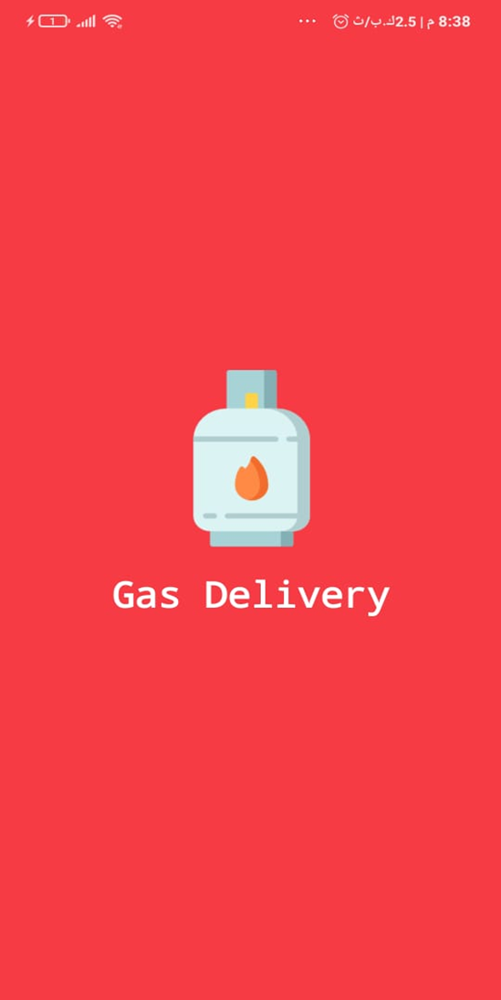
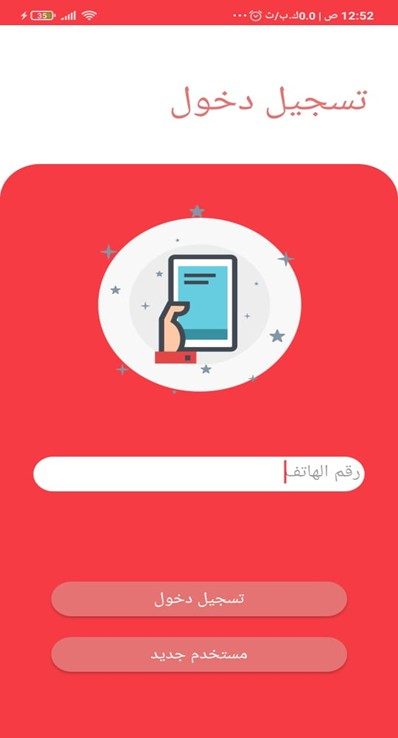
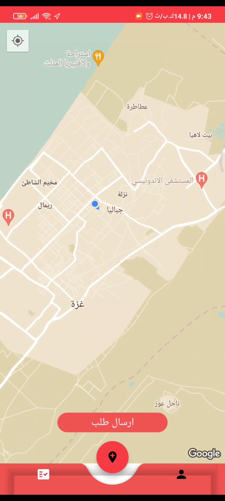
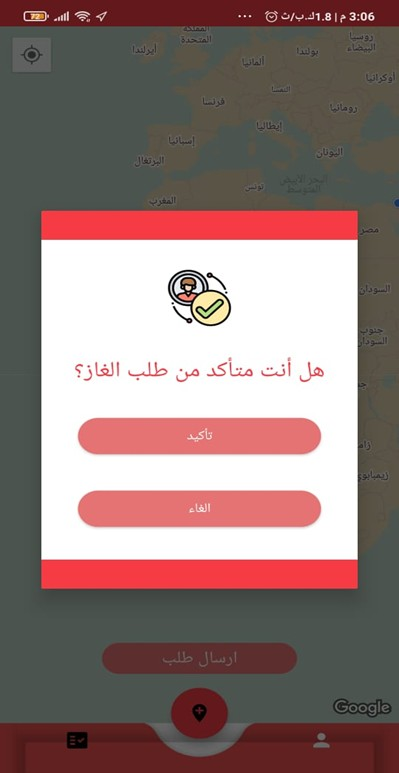
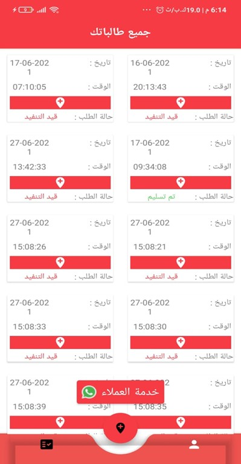
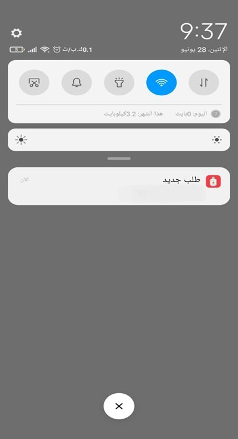

# Gas Delivery - User App

**Gas Delivery** is an Android application that allows users to request gas cylinder delivery by selecting their location on Google Maps and sending an order request to a gas distributor.

This repository represents the **User side** of the Gas Delivery system.

The project was built as a graduation project to simplify the gas ordering process, improve communication between customers and distributors, and organize delivery requests using Firebase and Google Maps.

---

## Features

- Splash screen
- User login
- User registration
- Phone number verification
- Select current location on Google Maps
- Send gas delivery request
- Confirm order before submitting
- View all user orders
- Track order status
- View user profile information
- Logout functionality
- Receive order notifications
- Arabic user interface

---

## Screenshots

<table align="center">
  <tr>
    <td align="center">
      
    </td>
    <td align="center">
      
    </td>
    <td align="center">
      
    </td>
  </tr>
  <tr>
    <td align="center"><b>Splash Screen</b></td>
    <td align="center"><b>Login Screen</b></td>
    <td align="center"><b>Register Screen</b></td>
  </tr>

  <tr>
    <td align="center">
      
    </td>
    <td align="center">
      
    </td>
    <td align="center">
      
    </td>
  </tr>
  <tr>
    <td align="center"><b>Phone Verification</b></td>
    <td align="center"><b>Map Screen</b></td>
    <td align="center"><b>Order Confirmation</b></td>
  </tr>

  <tr>
    <td align="center">
      
    </td>
    <td align="center">
      
    </td>
    <td align="center">
      
    </td>
  </tr>
  <tr>
    <td align="center"><b>My Orders</b></td>
    <td align="center"><b>Profile Screen</b></td>
    <td align="center"><b>Notification</b></td>
  </tr>
</table>

---

## Tech Stack

- Android
- Java
- XML Views
- Firebase Authentication
- Firebase Realtime Database
- Firebase Cloud Messaging
- Google Maps Platform APIs
- Android Studio

---

## App Flow

```text
Splash Screen
      ↓
Login / Register
      ↓
Phone Verification
      ↓
Map Screen
      ↓
Select Location
      ↓
Send Gas Request
      ↓
Order Confirmation
      ↓
My Orders / Profile
```

---

## How It Works

1. The user opens the application.
2. The splash screen appears for a few seconds.
3. The user logs in or creates a new account.
4. The user verifies the phone number using a verification code.
5. The app displays Google Maps.
6. The user selects or detects their current location.
7. The user sends a gas delivery request.
8. The request is stored in Firebase Realtime Database.
9. The distributor receives the order request.
10. The user can view all previous orders and check their status.
11. The user receives notifications about order updates.

---

## Main Components

### Authentication

Responsible for:

- Creating a new user account
- Logging in existing users
- Verifying the user phone number
- Managing user session

### Map Screen

Responsible for:

- Displaying Google Maps
- Detecting the user location
- Allowing the user to select a delivery location
- Sending the selected location with the order request

### Orders Screen

Responsible for:

- Displaying all user requests
- Showing order date and time
- Showing the current status of each order

### Profile Screen

Responsible for:

- Displaying user information
- Showing user phone number and gender
- Allowing the user to log out

### Notifications

Responsible for:

- Receiving order-related notifications
- Showing new order updates using Firebase Cloud Messaging

---

## Firebase Structure

The application uses Firebase as the backend service.

Main Firebase services used:

```text
Firebase Authentication
Firebase Realtime Database
Firebase Cloud Messaging
```

Firebase is used to store:

- User accounts
- User information
- Delivery requests
- Order status
- Notification data

---

## Project Goals

This project was developed to:

- Make gas ordering easier for customers
- Reduce time and effort needed to request gas delivery
- Improve communication between users and distributors
- Help distributors access customer locations through maps
- Organize and track delivery requests

---

## Project Purpose

Gas Delivery was built as a graduation project that turns the traditional gas ordering process into a simple Android-based experience.

The application demonstrates how authentication, maps, location selection, Firebase database, and notifications can be combined to create a practical delivery service app.

---

## Development Scope

This repository focuses on the user-side flow of the system: account creation, phone verification, location selection, sending gas requests, viewing orders, and receiving notifications.

The complete system also includes a manager/distributor side for viewing requests, checking customer locations, updating order status, and sending notifications.

---

## Future Improvements

- Add real-time order tracking
- Draw route between distributor and customer
- Add in-app chat
- Add estimated delivery time
- Improve UI/UX design
- Add order filtering
- Replace Firebase with a custom Laravel API
- Add better error handling
- Add English language support

---

## Important Notes

Before running the project, make sure to:

- Add your own `google-services.json` file
- Enable Firebase Authentication
- Enable Firebase Realtime Database
- Enable Firebase Cloud Messaging
- Enable Google Maps API
- Add your own Google Maps API key

Do not upload private API keys or sensitive Firebase configuration publicly.

---

## Folder Structure

```text
GasDelivery-User-App/
│
├── app/
├── screenshots/
│   ├── splash_screen.png
│   ├── login_screen.jpg
│   ├── register_screen.jpg
│   ├── verification_screen.jpg
│   ├── map_screen.jpeg
│   ├── order_confirmation.jpg
│   ├── orders_screen.jpg
│   ├── profile_screen.jpg
│   └── notification.jpg
│
├── README.md
├── build.gradle
└── settings.gradle
```

---

## Author

**Ibrahim Awad**  
Android Developer